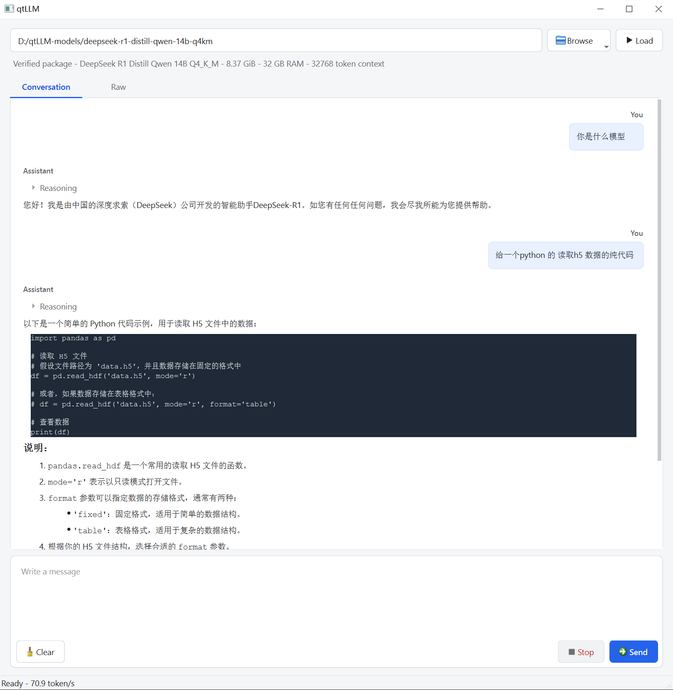

# qtLLM

qtLLM is a Windows desktop shell for running local GGUF language models. The
application runtime and model weights are distributed separately.

## Interface



## Distribution model

- `qtLLM-runtime-<version>.exe` contains the Qt application, `qtllm-worker`,
  the inference engine, and required runtime libraries. It contains no model
  weights.
- `qtLLM-model-<model-id>-<package-version>.zip` contains exactly one logical
  model, its preset, hashes, documentation, and license.
- An offline bundle may ship both artifacts together, but installs and updates
  them as separate components.

The application can scan a model-library directory, import a model package, or
open a compatible `.gguf` file directly. Direct GGUF files are shown as
unverified models because they have no package manifest or recorded provenance.

See [the development plan](docs/qt-local-llm-plan.md) and
[the model package specification](docs/model-package-spec.md). The current
Qt-to-worker protocol and its verification steps are documented in
[stage two](docs/stage-2-jsonl-ipc.md).

## Agent and MCP

The conversation has one input path for normal answers and tool-assisted work.
Internally, every request uses a local, bounded execution loop. The model can
propose only `call_tool` or `final` JSON actions; Qt validates the tool name and
arguments and applies the local policy. Calls that require approval appear as
inline conversation cards with a risk explanation, redacted arguments, and
one-time Allow or Reject actions. Unknown tools are treated as data-modifying
operations. MCP servers run as direct stdio child processes. No shell command
is built from model output, and server stdout is treated as JSON-RPC data while
stderr is diagnostic output.

To configure servers, copy [the example](docs/mcp-servers.example.json) to
`mcp-servers.json` beside the application and replace the absolute executable
path, working directory, environment allowlist, and tool allowlist. Only
enabled tools returned by `tools/list` and present in the local allowlist can be
called. Unknown tools, invalid arguments, timeouts, repeated calls, and late
responses are rejected or ignored. The default Agent limit is five tool calls
and two minutes per request.

## Diagnostics

The application and worker write separate 5 MiB rotating logs using `spdlog`.
On Windows they are stored under `%LOCALAPPDATA%/qtLLM/logs` as `qtLLM.log`
and `qtllm-worker.log`; set `QTLLM_LOG_DIR` to use another directory. Worker
stdout remains reserved for JSONL IPC, while stderr and process exit details
are copied into the application log.

## Build

Configure CMake with the vcpkg toolchain:

```text
-DCMAKE_TOOLCHAIN_FILE=<YOUR_VCPKG_ROOT>/scripts/buildsystems/vcpkg.cmake
```

The supported Windows CUDA build uses CUDA 11.8 with Visual Studio 2019
(v142). Open a *x64 Native Tools Command Prompt for VS 2019*, set
`VCPKG_ROOT`, and configure the RTX 3090 build with:

```powershell
cmake --preset cuda-release-vs2019 `
  -DCMAKE_CXX_COMPILER="C:/Program Files (x86)/Microsoft Visual Studio/2019/Community/VC/Tools/MSVC/14.29.30133/bin/Hostx64/x64/cl.exe" `
  -DCMAKE_C_COMPILER="C:/Program Files (x86)/Microsoft Visual Studio/2019/Community/VC/Tools/MSVC/14.29.30133/bin/Hostx64/x64/cl.exe" `
  -DCMAKE_CUDA_HOST_COMPILER="C:/Program Files (x86)/Microsoft Visual Studio/2019/Community/VC/Tools/MSVC/14.29.30133/bin/Hostx64/x64/cl.exe"
cmake --build --preset cuda-release-vs2019
ctest --test-dir cmake-build-cuda --output-on-failure
```

The root CMake configuration fixes all Windows vcpkg dependencies to the
repository's `x64-windows-vs2019` triplet automatically. CLion profiles only
need `-DQTLLM_ENABLE_CUDA=ON`; select a Visual Studio 2019 toolchain and reset
the profile cache after changing toolchains. A newer MSVC compiler is rejected
so the application and its dependencies cannot silently use different build
baselines.

The CUDA runtime is a separate artifact from the CPU runtime. It targets
compute capability 8.6 and the worker selects only GPU 0 at runtime; a
machine without a usable CUDA device falls back to CPU. Model weights remain
outside the repository and are packaged separately, one logical model per
model package. The recommended single-card model is
`DeepSeek-R1-Distill-Qwen-7B Q4_K_M` (roughly 4-5 GB).

The GPU runtime includes qtLLM's `ggml-cuda.dll`, but deliberately does not
redistribute NVIDIA CUDA runtime DLLs. GPU users must install a compatible
NVIDIA driver and CUDA Toolkit 11.8 before installing qtLLM. The process
`PATH` must be able to resolve `cudart64_110.dll`, `cublas64_11.dll`, and
`cublasLt64_11.dll` (normally from `%CUDA_PATH%\bin`); `nvcuda.dll` is supplied
by the NVIDIA driver. If these dependencies are unavailable, use the CPU
runtime, which does not require CUDA.

Source files are discovered recursively. Keep headers, implementations, and
Designer forms inside each functional module's `include`, `src`, and `ui`
directories. `app/main.cpp` remains beside `app/CMakeLists.txt`.
The worker entry point follows the same rule: `worker/main.cpp` remains beside
`worker/CMakeLists.txt`.

Development executables are written directly to the CMake build directory.
On Windows, building `qtLLM` also copies the Qt platform plugin to the adjacent
`platforms` directory, so the application can be launched from the build tree.
The last successfully loaded model path is stored in `qtLLM.ini` beside the
executable and restored into the model path field on the next launch.

Run the default test suite without loading a model:

```powershell
ctest --test-dir cmake-build-release --output-on-failure
```

Set `QTLLM_TEST_MODEL` to a GGUF file or a model package directory containing
`model.gguf` to include the real-model worker lifecycle test.

For an explicit CUDA integration test, also set
`QTLLM_TEST_GPU_LAYERS=-1` and `QTLLM_TEST_DEVICE_CONTAINS="RTX 3090"` before
running the CUDA test preset. The test then fails unless the worker reports the
expected GPU.
